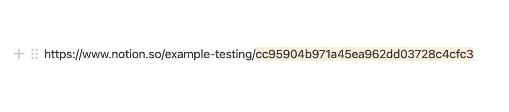

# Introduction to the Notion API with JavaScript

Learn the Notion SDK for JavaScript through small, runnable examples. Start by
appending a block to a page, then move on to databases, queries, file uploads,
comments, and page templates.

> [!IMPORTANT]
> These examples make live changes in Notion. Basic examples append content to
> `NOTION_PAGE_ID`; intermediate examples also create databases, pages, file
> uploads, and comments beneath that page. Use a test page. Running an example
> again creates or appends the content again.

## Quickstart

1. Create an integration in the
   [integrations dashboard](https://www.notion.com/my-integrations) and copy its
   API key.
2. Create a test page, then use **Add connections** in the page menu to connect
   your integration. Enable the content or comment capabilities required by the
   example you want to run.
3. From the repository root, install and configure the examples:

   ```sh
   cd examples/intro-to-notion-api
   npm install
   cp .env.example .env
   ```

   Add the integration key and test page ID to `.env`:

   ```dotenv
   NOTION_API_KEY=<your-notion-api-key>
   NOTION_PAGE_ID=<your-test-page-id>
   ```

   The page ID is the 32-character ID in the page URL:

   

4. Run the first example:

   ```sh
   npm run basic:1
   ```

When it succeeds, the test page contains a new **Types of kale** heading and
the terminal prints the API response for the new block.

## Choose an example

Each script is self-contained; intermediate examples create their own database
rather than reusing one created by an earlier script.

| Command                  | Result in Notion                                                        |
| ------------------------ | ----------------------------------------------------------------------- |
| `npm run basic:1`        | Appends a heading                                                       |
| `npm run basic:2`        | Appends a heading and linked paragraph                                  |
| `npm run basic:3`        | Appends a heading and styled, linked paragraph                          |
| `npm run intermediate:1` | Creates a database with grocery-item properties                         |
| `npm run intermediate:2` | Creates a grocery database and three pages                              |
| `npm run intermediate:3` | Creates the database and pages, then prints filtered query results      |
| `npm run intermediate:4` | Creates the database and pages, then prints filtered and sorted results |
| `npm run intermediate:5` | Uploads an image, appends blocks, and creates a comment with the image  |
| `npm run intermediate:6` | Creates a task database, a template page, and a page from that template |

Open the corresponding file under `basic/` or `intermediate/` to see the API
calls behind each result.

## Learn more

- [Notion API guides](https://developers.notion.com/docs)
- [Notion API reference](https://developers.notion.com/reference/intro)
- [Build your first integration](https://developers.notion.com/docs/create-a-notion-integration)
- [Other cookbook examples](../README.md)
